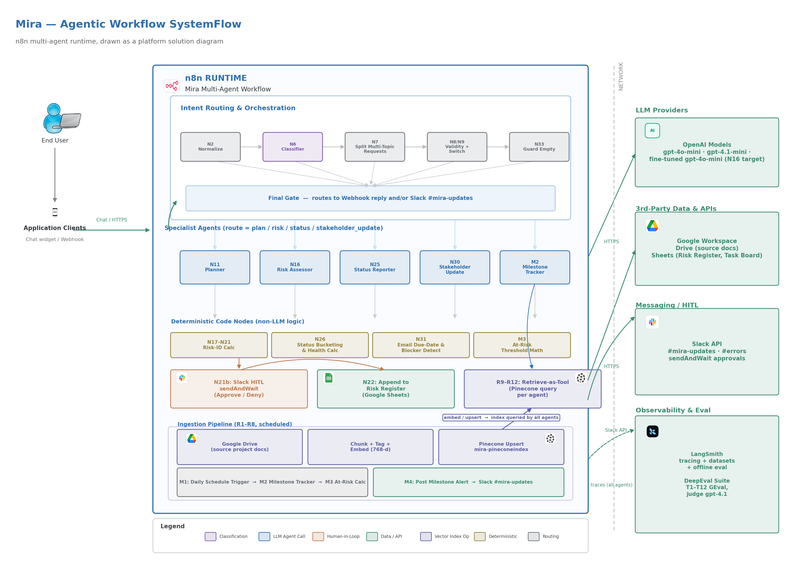
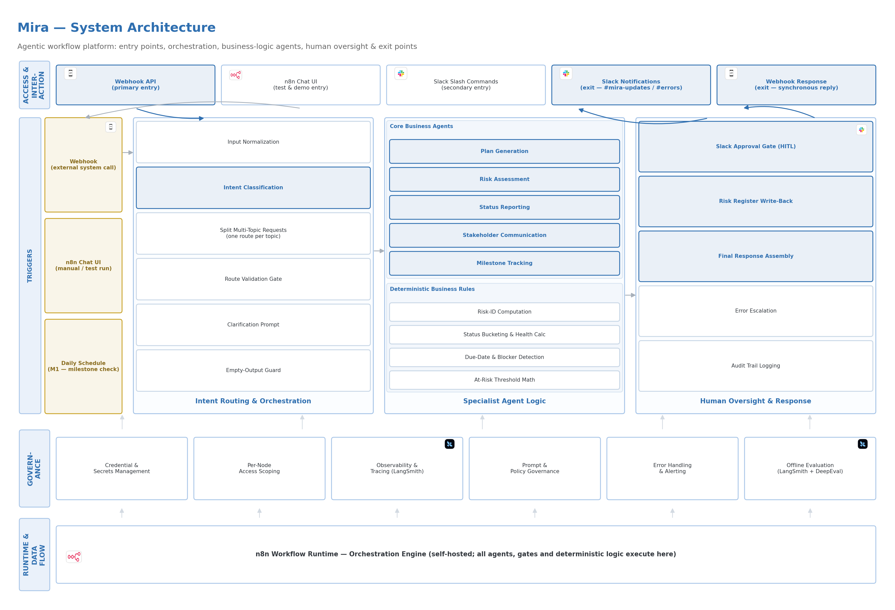
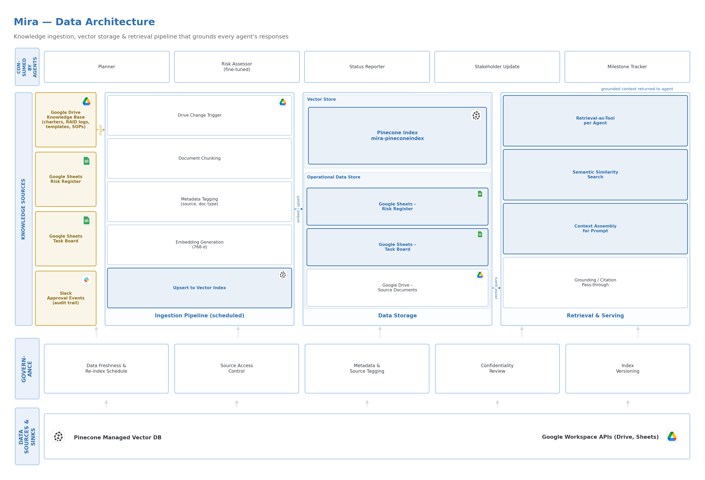

# Mira — AI-Powered Project Intelligence Assistant

Mira is a multi-agent, RAG-grounded project-intelligence assistant built entirely in [n8n](https://n8n.io/). It ingests a project's own source documents (project description, timeline, task board, risk register) into a Pinecone vector index, then serves plan generation, risk assessment, weekly status reporting, stakeholder update drafting, and daily milestone alerting on top of that grounded data — with a deterministic (non-LLM) verification layer behind every agent so its own claims about dates, counts, and statuses are checked in code rather than trusted at face value.

## Problem

Project teams running an AI-adoption initiative (the reference engagement here: ABCDE Ltd., a mid-sized logistics/supply-chain company) generate a constant stream of PM/TPM busywork — turning a project description into a plan, keeping a risk register current, compiling a status report from a live task board, chasing at-risk milestones, and writing stakeholder updates — all of which requires pulling together the same underlying project data by hand, repeatedly, and is prone to the two failure modes generic LLM assistants are worst at: hallucinated facts and silently wrong date/count arithmetic.

## Objective

Build an assistant that answers project-management requests **grounded in the team's real, live documents** (not general knowledge), routes different kinds of requests to purpose-built specialist logic instead of one generic prompt, and never lets an LLM's own arithmetic (a due date, a count, an "at risk" judgment) reach the user unverified.

## Approach & Key Trade-offs

- **Router/Dispatcher orchestration**, chosen over a sequential pipeline or a hierarchical decomposition: a single Classifier Agent routes each request to the specialist agent(s) it actually needs, supporting multi-intent messages (e.g. "give me a status report and assess the risks" routes to both).
- **Retrieve-as-tool RAG**, chosen over a static pre-fetch: each specialist agent calls a scoped Pinecone retrieval tool itself, on its own judgment of what it needs, rather than being handed a fixed top-k context block up front.
- **A deterministic guardrail layer behind every agent**, chosen over prompt-only grounding: each specialist agent's LLM output is re-parsed and re-verified in a downstream Code node — due-date math, at-risk thresholds, status re-bucketing, and count enforcement are all recomputed from the raw retrieved data rather than trusted from the model's own output. This was the single highest-value decision found during testing (see `docs/` for the LangSmith/DeepEval findings that motivated it).
- **Human-in-the-loop, scoped narrowly**: only new risk-register *writes* pause for a Slack approval gate — every other response streams straight back, so oversight is targeted at the one place the workflow mutates a system of record rather than slowing down every request.
- **Dual entry point**: a webhook (the primary, external-system entry point — see `code/MiraProject/ask-mira.html`, a small dependency-free test client) and the native n8n chat widget (manual/demo entry), normalized into one shape before anything else runs.
- Full rationale for these and the other alternatives considered (local vs. cloud n8n, bare vague-risk queries, etc.) is written up in `docs/Mira-Component Level Design Document.pdf`, section "Alternative Approaches Considered."

## What It Does

**Core capabilities** (all three required by the brief):
- **Project Plan Generation** — a structured plan (phases, milestones, deliverables, timeline), grounded in the real project description.
- **Risk Assessment** — a categorized risk matrix (description, impact, mitigation), grounded in the live risk register, with new risks gated behind Slack approval before they're written back.
- **Weekly Status Reporting** — tasks by status, blockers, at-risk items, and an overall health read, grounded in the live task board.

**Extended capabilities built** (the brief required at least one; several were built here):
- **Milestone Alert System** — a daily scheduled check that flags at-risk or overdue milestones and posts to Slack.
- **Human-in-the-Loop Approval** — new risk-register entries pause for Slack `sendAndWait` approval before being written.
- **Stakeholder Update Generation** — drafts a short progress-update email grounded in real task/milestone data, with blocker and missed-deadline detection done deterministically rather than asserted by the model.
- **Fine-tuning of the Risk Assessor Agent** — a fine-tuned `gpt-4o-mini` variant trained on this build's own confirmed bug/fix pairs (see `code/FineTuning/`).

*(The PRD notes five extended capabilities were selected in total against the brief's optional list — see `docs/Mira - Problem Statement & PRD.pdf` §3 for the complete rationale on what was chosen and what was descoped.)*

## Architecture

**System Flow** (agentic workflow, drawn as a platform solution diagram):



**System Architecture** (entry points, orchestration, business-logic agents, human oversight & exit points):



**Data Architecture** (Google Drive knowledge base → ingestion pipeline → Pinecone vector store → retrieval-as-tool serving):



At a high level, two independently-schedulable n8n workflows implement Mira:

- **Ingestion pipeline** (`code/MiraProject/MiraProject-PineconeIngestion.json`) — pulls project files from a Google Drive folder, chunks and embeds them (OpenAI embeddings, 768-d), and upserts them into a Pinecone index. Wipe-and-rebuild on each run for idempotency.
- **Retrieval pipeline** (`code/MiraProject/MiraProject-AIPoweredIntelligentAssistant-NewRefined.json`) — the live, request-serving workflow: a Classifier Agent dispatches to one or more of five specialist agents (Planner, Risk Assessor, Status Reporter, Stakeholder Update, Milestone Tracker), each backed by its own Pinecone retrieval tool and its own downstream deterministic verification step, converging on a Final Gate that replies via webhook or posts to Slack depending on how the request came in.

Full node-by-node documentation (every agent's system prompt, every deterministic Code node's logic, and the human-in-the-loop approval chain) is in `docs/Mira-Workflow-Architecture-Node-Reference.pdf`.

## Sample Data

The workflows are grounded against a set of sample project records for the reference engagement (ABCDE Ltd.'s AI-adoption initiative), provided in `resourcefiles/`:

- `ABCDE Ltd. AI Adoption - Project Description.pdf` — the project brief the Planner Agent grounds against.
- `Mira Timeline.xlsx`, `Mira Task Board.xlsx`, `Mira Risk Register.xlsx` — the live Google Sheets data the Status Reporter, Milestone Tracker, and Risk Assessor read from (read-only; Mira never writes to Timeline or Task Board, and only writes new, approved entries to the Risk Register).
- `ForLangsmithEval-mira_Ds_v5.csv` — the LangSmith evaluation dataset (test cases, expected deliverables, grading-rubric fields) used for offline evaluation.

## Results / Learnings

- A baseline set of 14 test cases (detailed/vague plan, risk, and status requests; risk analysis; milestone tracking; stakeholder comms; two human-in-the-loop scenarios) was run and captured end-to-end — see `docs/Mira-Baseline-Test-Results.pdf`.
- Offline evaluation was run in LangSmith (Hallucination, Assertions, Answer Relevance, Bias & Fairness evaluators) plus a separate, targeted DeepEval suite against the Risk Assessor Agent specifically (Vague Statement Handling, Risk Groundedness, Requested Count Enforcement, New vs. Existing Risk Routing) — full traces, dataset setup, and findings are documented in `docs/Mira - Screenshots Workflow, In Action & Observability.pdf`.
- The single most valuable finding from that testing: date and count arithmetic — how far away a milestone is, whether a task is actually complete, whether a requested top-N count is met — is exactly the kind of judgment that benefits from deterministic verification rather than model-only reasoning. That finding is what drove the deterministic-guardrail-behind-every-agent design: each agent's output is independently re-checked against the live source data before it reaches the user, so responses stay grounded in verifiable facts.
- Fine-tuning the Risk Assessor Agent on this build's own confirmed bug/fix pairs (`code/FineTuning/training_data_risk_assessor.jsonl`, 9 examples) improved those specific failure modes; the before/after comparison harness is `code/FineTuning/test_risk_assessor.py`.

## Tech Stack

- **Orchestration runtime:** [n8n](https://n8n.io/) (self-hosted), 60 nodes across the retrieval workflow, 12 across the ingestion workflow
- **Agents / LLM orchestration:** `@n8n/n8n-nodes-langchain` (agent, chatTrigger, lmChatOpenAi, embeddingsOpenAi, vectorStorePinecone, memoryBufferWindow nodes)
- **LLMs:** OpenAI `gpt-4o-mini` (Classifier, Planner, Risk Assessor, and Milestone Tracker agents; also the fine-tuning base model), `gpt-4.1-mini` (Status Reporter and Stakeholder Update agents)
- **Vector store:** Pinecone (single namespace, 768-dimension embeddings, metadata-filtered per agent)
- **Data sources:** Google Drive (source documents, ingestion), Google Sheets (Risk Register — read/write, gated by Slack approval on writes; Task Board, Timeline — read-only)
- **Human-in-the-loop / notifications:** Slack (`sendAndWait` approval gate; `#mira-updates` and `#errors` channels)
- **Observability & evaluation:** LangSmith (tracing + offline dataset evaluation), DeepEval (targeted GEval suite for the Risk Assessor Agent)
- **Fine-tuning:** OpenAI fine-tuning API, base model `gpt-4o-mini-2024-07-18`

## How to Run

1. **Import the workflows** into an n8n instance: `code/MiraProject/MiraProject-PineconeIngestion.json` and `code/MiraProject/MiraProject-AIPoweredIntelligentAssistant-NewRefined.json` (both are exported `active: false` — activate on import to receive live triggers).
2. **Configure credentials** inside n8n for: Google Drive, Google Sheets, Pinecone, OpenAI, and Slack (referenced by name in the workflow JSON; no credentials are embedded in these exports).
3. **Run the ingestion workflow once** (manually, or on its schedule trigger) to populate the Pinecone index from your Drive folder.
4. **Test the retrieval workflow** either via the n8n chat widget, or by opening `code/MiraProject/ask-mira.html` in a browser and pointing it at your webhook URL (defaults to `http://localhost:5678/webhook/Mirabot-NewRefined`, matching the workflow's webhook path).
5. **Optional — LangSmith tracing:** set `LANGSMITH_TRACING`, `LANGSMITH_ENDPOINT`, `LANGSMITH_API_KEY`, `LANGSMITH_PROJECT` as environment variables on the n8n process; the LangChain nodes pick these up automatically. Run `code/Langsmith/CheckforDatasetID.py` to look up a dataset ID, then `code/Langsmith/Langsmith-Eval-Python_script.py` to run an offline evaluation against it.
6. **Optional — fine-tune the Risk Assessor Agent:** `pip install openai`, set `OPENAI_API_KEY`, then run `code/FineTuning/fine_tune_risk_assessor.py` (trains against `training_data_risk_assessor.jsonl`) and `code/FineTuning/test_risk_assessor.py` (before/after DeepEval comparison; `pip install deepeval` as well).

## Repository Structure

```
Mira-ProjectManagementAgent/
├── README.md
├── code/
│   ├── MiraProject/        # the two n8n workflow exports + the ask-mira.html test client
│   ├── FineTuning/         # fine-tuning script, training data, before/after eval harness
│   └── Langsmith/          # LangSmith offline-evaluation script + dataset-ID lookup helper
├── docs/                   # PRD, CLDD, node reference, screenshots/observability, baseline test results,
│                            # traceability matrix, and the three architecture diagrams
└── resourcefiles/          # sample project description + Risk Register / Task Board / Timeline / eval dataset
```
